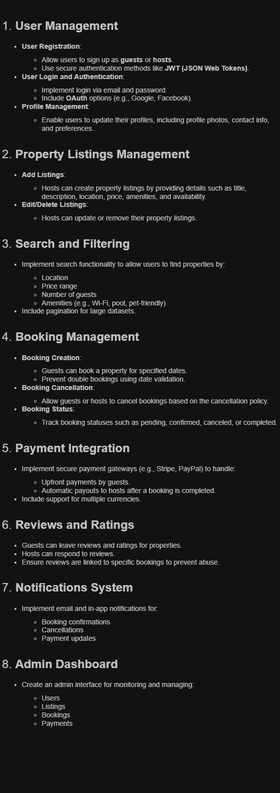

# 🏠 Airbnb Clone Backend Features and Functionalities

This document outlines the core features and functionalities required for the **backend of the Airbnb Clone project**. The backend is responsible for managing users, listings, bookings, payments, reviews, notifications, and administrative operations. It exposes RESTful APIs (or GraphQL endpoints) that power the frontend client and integrates third-party services for authentication, payments, and messaging.

## 🔐 1. User Management

### User Registration
- Allow users to register as **guests** or **hosts**.
- Use **secure authentication mechanisms** (e.g., JWT for token-based authentication).
- Validate unique email addresses and strong passwords.

### User Login and Authentication
- Enable login via **email and password**.
- Support **OAuth** providers (e.g., Google, Facebook) using external auth integrations.

### Profile Management
- APIs for users to:
  - Retrieve their profile data.
  - Update their profile (name, profile picture, contact details, preferences).
  - Upload profile pictures (e.g., using cloud storage).

## 🏘️ 2. Property Listings Management

### Add Listings
- Hosts can create listings by submitting:
  - `title`, `description`, `location`, `price`, `property type`, `number of guests`, `amenities`, `availability calendar`.
- Validate and sanitize input data.

### Edit/Delete Listings
- Hosts can update or remove their own listings.
- Admins can moderate or remove inappropriate listings.

## 🔍 3. Search and Filtering

### Search Functionality
- Endpoint to search listings by:
  - **Location**
  - **Price range**
  - **Number of guests**
  - **Amenities** (e.g., Wi-Fi, pool, pet-friendly)

### Filtering and Pagination
- Enable paginated responses for efficient frontend rendering.
- Support sorting by price, rating, and recency.

## 📅 4. Booking Management

### Booking Creation
- Guests can book listings by specifying:
  - `check-in` and `check-out` dates.
  - `number of guests`.
- Validate against listing availability.
- Prevent **double bookings** using availability conflict checks.

### Booking Cancellation
- Allow bookings to be canceled by guests or hosts.
- Apply cancellation rules and fees based on policy.

### Booking Status Management
- Track statuses like:
  - `pending`, `confirmed`, `cancelled`, `completed`.

## 💳 5. Payment Integration

### Payment Processing
- Integrate secure payment gateways (e.g., **Stripe**, **PayPal**).
- Charge guests during booking creation.
- Store transaction metadata securely.

### Host Payouts
- Initiate automatic payouts to hosts after stay completion.
- Handle multi-currency transactions.

### Refunds and Disputes
- Support refund requests in compliance with cancellation policies.
- Log and handle payment disputes.

## 🌟 6. Reviews and Ratings

### Review System
- Guests can leave **reviews and star ratings** for completed bookings.
- Hosts can **respond** to reviews publicly.

### Abuse Prevention
- Only allow reviews for **verified bookings**.
- One review per booking policy.

## 🔔 7. Notifications System

### Email & In-App Notifications
- Notify users about:
  - Booking status updates
  - New messages or reviews
  - Payment success or failure
- Use background workers (e.g., Celery, Sidekiq) for async dispatch.

### Notification Channels
- Email (via SMTP or services like SendGrid)
- In-app (stored and fetched via API)
- Optional push notifications for mobile

## 🛠️ 8. Admin Dashboard and Tools

### Administrative Operations
- Monitor and manage:
  - **Users**
  - **Listings**
  - **Bookings**
  - **Payments**
  - **Reviews**
  
### Moderation Features
- Ban or deactivate users
- Remove inappropriate listings or content
- View platform-wide analytics and reports

---
### Project Structure Overview
This section provides a visual representation of the backend system’s features and functionalities using a diagram designed in Draw.io.

### System Design Diagram
The exported PNG image of the system architecture can be found in this directory with the following file name:

**File Name**: features-and-functionalities.png
#### Airbnb Feature and Functionalities Diagram 
