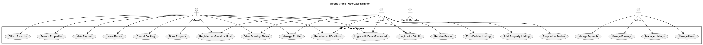

# Airbnb Clone – Use Case Diagram

This repository contains a detailed **Use Case Diagram** that visualizes the core features and user interactions for the **Airbnb Clone Backend System**. The diagram helps stakeholders, developers, and designers understand how users (guests, hosts, and admins) interact with the system and how various backend functionalities are organized.

---

## 📌 Description

The diagram illustrates major backend modules such as:

- **User Management** (Registration, Login, Profile)
- **Property Listings**
- **Search & Filtering**
- **Booking System**
- **Payment Integration**
- **Reviews and Ratings**
- **Notification System**
- **Admin Dashboard**

The diagram uses:
- 🧭 `<<include>>` relationships for mandatory use cases
- 🔀 `<<extend>>` for optional behaviors
- 👥 Generalization for actor inheritance (e.g., Guest and Host inherit from User)
- 🖼 A **clear system boundary** to frame all backend functionalities

---

## 🗂 Directory Structure
```bash
use-case-diagram/
├── README.md
├── airbnb_usecase_diagram.puml # PlantUML source file
└── airbnb_usecase_diagram.png # PNG export of the diagram
```

## 🛠 Features Represented in the Diagram

1. **User Management**
   - Register as Guest or Host
   - Login (Email/Password or OAuth)
   - Profile update and settings

2. **Property Listings**
   - Add, edit, or remove listings

3. **Search & Filtering**
   - Filter by location, price, guests, and amenities
   - Paginated results

4. **Booking System**
   - Booking creation, cancellation, and status tracking

5. **Payment**
   - Guest payments
   - Host payouts
   - Support for multiple currencies

6. **Reviews**
   - Guests can rate and review
   - Hosts can respond

7. **Notifications**
   - In-app and email notifications

8. **Admin Dashboard**
   - Manage users, listings, bookings, and payments

##  Preview


## 🧠 Purpose

This diagram serves as a **blueprint** for backend API development and aids in planning endpoints, responsibilities, and role-based access for the Airbnb Clone system.